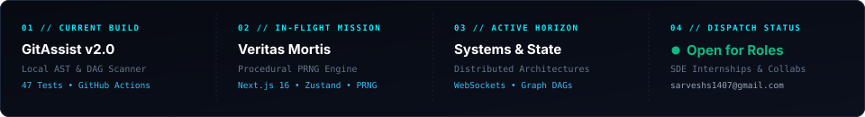
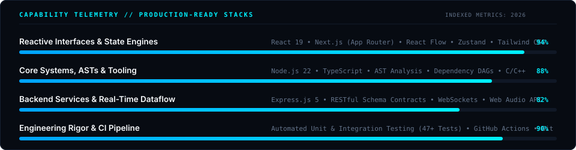

<div align="center">
  
  <br /><br />
  
</div>

<p align="center">
  <a href="#-active-telemetry"><code>SYS_TELEMETRY</code></a> &nbsp;•&nbsp;
  <a href="#-featured-systems"><code>FEATURED_SYSTEMS</code></a> &nbsp;•&nbsp;
  <a href="#-capability-matrix"><code>CAPABILITIES</code></a> &nbsp;•&nbsp;
  <a href="#-current-missions"><code>ACTIVE_MISSIONS</code></a> &nbsp;•&nbsp;
  <a href="https://www.linkedin.com/in/sarveshs007/"><code>LINKEDIN</code></a> &nbsp;•&nbsp;
  <a href="mailto:sarveshs1407@gmail.com"><code>TRANSMISSION</code></a>
</p>

<p align="center">
  
</p>

<h3 id="-active-telemetry">📡 &nbsp; Live System Status Panel</h3>

<p align="center">
  
</p>

```yaml
Operator: Sarvesh S
Designation: Full-Stack Software Engineer & Systems Builder
Core Philosophy: "Deconstruct complex abstractions. Build deterministic systems. Ship testable code."
Coordinates: India (UTC +05:30) // Remote Distributed Teams
Secure Dispatch: sarveshs1407@gmail.com // linkedin.com/in/sarveshs007
```

<p align="center">
  
</p>

<h2 id="-featured-systems">🛸 &nbsp; Featured Deployed Systems</h2>

<p>Production-grade architectures, developer utilities, and procedural simulation engines designed from first principles:</p>

<table>
  <!-- SYSTEM 01 -->
  <tr>
    <td width="100%">
      <div align="right">
        <code>SYS_01 // TOOLING</code> &nbsp;
        
      </div>
      <h3>⚡ <a href="https://github.com/SarveshS1407/GitAssist">GitAssist</a> — <i>Codebase Archaeology &amp; DAG Dependency Inspector</i></h3>
      <p><b>Purpose:</b> Navigating massive or legacy codebases is cognitively demanding. Developers inadvertently introduce circular references and breaking changes because project dependency graphs remain invisible.</p>
      <p><b>Architecture &amp; Engineering:</b></p>
      <ul>
        <li><b>Zero-Cloud AST Ingestion:</b> Walks local disk directory trees to parse module imports and export symbols completely offline—no source code ever leaves the client machine.</li>
        <li><b>Cycle Detection Algorithm:</b> Implements directed graph traversal to detect circular module dependencies prior to test execution.</li>
        <li><b>Change Risk Metric:</b> Cross-references Git commit churn frequency against file line complexity to calculate localized risk scores.</li>
        <li><b>Engineering Rigor:</b> Engineered with <b>47 automated unit and integration tests</b> using Node's native test runner and validated continuously via GitHub Actions CI.</li>
      </ul>
      <p>
        <code>Node.js 22</code> • <code>TypeScript / ESNext</code> • <code>Mermaid.js</code> • <code>Automated Testing</code> • <code>GitHub Actions CI</code>
      </p>
      <div align="right">
        <a href="https://github.com/SarveshS1407/GitAssist"><b>[ Inspect Architecture &amp; Source Code → ]</b></a>
      </div>
    </td>
  </tr>

  <!-- SYSTEM 02 -->
  <tr>
    <td width="100%">
      <div align="right">
        <code>SYS_02 // ENGINE</code> &nbsp;
        
      </div>
      <h3>🩸 <a href="https://github.com/SarveshS1407/veritas-mortis">Veritas Mortis</a> — <i>Deterministic Procedural Mystery Engine</i></h3>
      <p><b>Purpose:</b> Procedural narrative games typically suffer from timeline contradictions and incoherent state mutations. This engine guarantees 100% reproducible crime scenes and suspect testimonies from a single seed.</p>
      <p><b>Architecture &amp; Engineering:</b></p>
      <ul>
        <li><b>Deterministic Seed Pipeline:</b> Utilizes the <b>Mulberry32 PRNG</b> algorithm to generate identical crime alibis, physical evidence, and toxicology chromatography data given the same integer seed.</li>
        <li><b>Dynamic Composure State:</b> Simulates suspect psychological stress across a 4-tier state machine (<code>Calm → Deflecting → Cornered → Broken</code>), dynamically unlocking interrogation branches.</li>
        <li><b>Forensic UI Shaders:</b> Includes responsive 365nm UV blacklight inspection shaders and an interactive yarn-board deduction matrix.</li>
        <li><b>Strict Domain Contracts:</b> Engineered in strict TypeScript, completely decoupling immutable procedural generation logic from UI reactivity via Zustand.</li>
      </ul>
      <p>
        <code>Next.js 16 (App Router)</code> • <code>React 19</code> • <code>TypeScript</code> • <code>Zustand</code> • <code>Framer Motion</code> • <code>Tailwind CSS</code>
      </p>
      <div align="right">
        <a href="https://github.com/SarveshS1407/veritas-mortis"><b>[ Inspect Architecture &amp; Source Code → ]</b></a>
      </div>
    </td>
  </tr>

  <!-- SYSTEM 03 -->
  <tr>
    <td width="100%">
      <div align="right">
        <code>SYS_03 // INTERFACES</code> &nbsp;
        
      </div>
      <h3>👥 <a href="https://github.com/Dhyanesh2603/Codemap">CodeMap (ImpactLens AI)</a> — <i>Live Architecture &amp; Ripple Impact Visualizer</i></h3>
      <p><b>Purpose:</b> Visualizes the full ripple blast radius of repository pull requests before code merges occur, preventing unseen breakages across microservices.</p>
      <p><b>Architecture &amp; Engineering:</b></p>
      <ul>
        <li><b>Interactive Viewport Engine:</b> Led frontend architecture to map complex service hierarchies into zoomable, pannable node graphs using React Flow (<code>@xyflow/react</code>).</li>
        <li><b>Ripple Propagation Animation:</b> Engineered dynamic animated wave paths that trace downstream affected services in red/green when a file is modified.</li>
        <li><b>Multiplayer State Streaming:</b> Integrated bi-directional WebSockets to synchronize graph inspection in real-time across concurrent reviewer sessions.</li>
      </ul>
      <p>
        <code>Next.js App Router</code> • <code>TypeScript</code> • <code>React Flow</code> • <code>WebSockets</code> • <code>Tailwind CSS</code>
      </p>
      <div align="right">
        <a href="https://github.com/Dhyanesh2603/Codemap"><b>[ Inspect Architecture &amp; Source Code → ]</b></a>
      </div>
    </td>
  </tr>

  <!-- SYSTEM 04 -->
  <tr>
    <td width="100%">
      <div align="right">
        <code>SYS_04 // SIMULATION</code> &nbsp;
        
      </div>
      <h3>🏙️ <a href="https://github.com/SarveshS1407/project-tycoon">Project Tycoon v3.0</a> — <i>Engineering Squad Simulator &amp; Web Audio Synth</i></h3>
      <p><b>Purpose:</b> Models the mathematical interplay between developer squad velocity, technical debt accumulation, and capital runway against a simulated Rival AI CTO.</p>
      <p><b>Architecture &amp; Engineering:</b></p>
      <ul>
        <li><b>Native Web Audio Synthesizer:</b> Programmed a retro 8-bit procedural sound synthesizer using native browser <b>Web Audio API</b> oscillators and gain nodes—zero static audio asset dependencies.</li>
        <li><b>Quantitative Simulation Loops:</b> Formulated debt penalty algorithms calculating velocity degradation based on skill mismatch and refactoring trade-offs.</li>
        <li><b>RESTful State Persistence:</b> Implemented Express.js 5 REST backend managing player sessions, game saves, and competitive PvP leaderboards.</li>
      </ul>
      <p>
        <code>React 19</code> • <code>Express.js 5</code> • <code>Web Audio API</code> • <code>Tailwind CSS v4</code> • <code>Vite</code>
      </p>
      <div align="right">
        <a href="https://github.com/SarveshS1407/project-tycoon"><b>[ Inspect Architecture &amp; Source Code → ]</b></a>
      </div>
    </td>
  </tr>
</table>

<p align="center">
  
</p>

<h2 id="-capability-matrix">⚡ &nbsp; Engineering Capabilities &amp; Arsenal</h2>

<p align="center">
  
</p>

<table>
  <tr>
    <td width="33%" valign="top">
      <b>01 // CORE LANGUAGES</b>
      <br /><br />
      • <code>TypeScript</code> (Strict Mode)<br />
      • <code>JavaScript</code> (ESNext / V8)<br />
      • <code>C / C++</code> (Memory &amp; Pointers)<br />
      • <code>Python</code> (Scripting &amp; Data)<br />
      • <code>HTML5 / CSS3</code> (Modern Spec)
    </td>
    <td width="33%" valign="top">
      <b>02 // INTERFACE &amp; STATE</b>
      <br /><br />
      • <code>React 19</code> (Hooks &amp; Concurrency)<br />
      • <code>Next.js</code> (App Router Architecture)<br />
      • <code>React Flow</code> (Graph Rendering)<br />
      • <code>Zustand</code> (Decoupled State)<br />
      • <code>Tailwind CSS &amp; Framer Motion</code>
    </td>
    <td width="33%" valign="top">
      <b>03 // RUNTIMES &amp; INFRA</b>
      <br /><br />
      • <code>Node.js 22</code> (Async I/O)<br />
      • <code>Express.js 5</code> (REST Contracts)<br />
      • <code>WebSockets &amp; Web Audio API</code><br />
      • <code>GitHub Actions CI / CD</code><br />
      • <code>Git</code> (Branching &amp; Rebasing)
    </td>
  </tr>
</table>

<p align="center">
  
</p>

<h2 id="-current-missions">🎯 &nbsp; Active Missions &amp; Horizons</h2>

<table>
  <tr>
    <td width="33%" valign="top">
      <code>MISSION_01</code>
      <h4>🧬 Compilers &amp; AST Analysis</h4>
      <p>Deep-diving into lexical analysis, AST walkers, and building custom offline static analyzers to detect architectural antipatterns before commit time.</p>
    </td>
    <td width="33%" valign="top">
      <code>MISSION_02</code>
      <h4>🌐 Distributed Dataflows</h4>
      <p>Exploring high-throughput WebSocket coordination, event-driven state reconciliation, and fault-tolerant multi-client sync topologies.</p>
    </td>
    <td width="33%" valign="top">
      <code>MISSION_03</code>
      <h4>📐 Open-Source Systems</h4>
      <p>Studying upstream production repositories, contributing bug fixes, and mastering RFC-driven engineering conventions in public codebases.</p>
    </td>
  </tr>
</table>

<p align="center">
  
</p>

## 📊 &nbsp; Continuous Telemetry &amp; Metrics

<div align="center">
  
  
</div>

<div align="center">
  <br />
  
</div>

<p align="center">
  
</p>

<div align="center">
  <h3>📡 Open Transmission Dispatch</h3>
  <p>Available for Software Engineering Internships, High-Throughput Engineering Teams, and Ambitious Builds.</p>
  <p>
    <a href="https://www.linkedin.com/in/sarveshs007/"></a> &nbsp;
    <a href="mailto:sarveshs1407@gmail.com"></a>
  </p>
  <br />
  <sub>MISSION CONTROL SYSTEM // OPERATOR ID: <code>SARVESHS1407</code> // OBSERVATORY ONLINE</sub>
</div>
